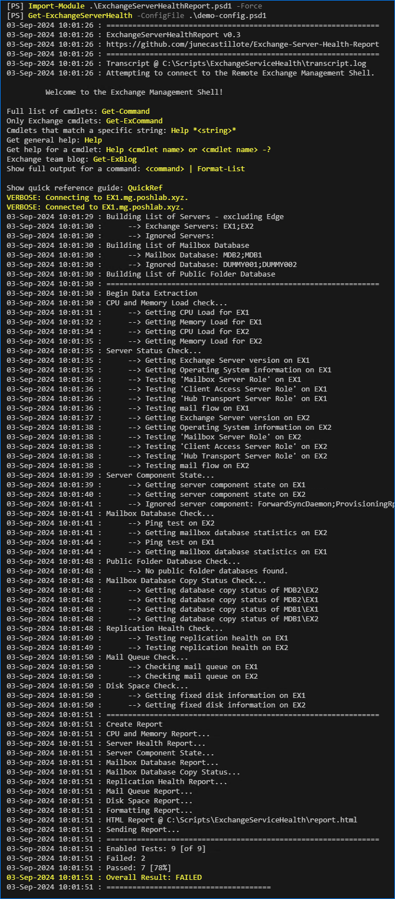

# Exchange Server Health Report

PowerShell script to extract and report Exchange server health statistics.

> NOTE: This script is based on the previous script called [Get-ExchangeHealth.ps1](https://github.com/junecastillote/Get-ExchangeHealth). I decided to create a new repository for a new script because of many breaking changes made on this one, especially to the configuration file contents and parameters.

- [What the script does?](#what-the-script-does)
- [Sample Output](#sample-output)
- [Get-ExchangeServerHealth.ps1](#get-exchangeserverhealthps1)
- [Configuration File Template](#configuration-file-template)
- [Configuration File Settings Explained](#configuration-file-settings-explained)
  - [Branding](#branding)
  - [TestItem](#testitem)
  - [Output](#output)
  - [Threshold](#threshold)
  - [Mail](#mail)
  - [Exclusion](#exclusion)
- [Usage Examples](#usage-examples)
  - [Example 1: Running Manually in Exchange Management Shell](#example-1-running-manually-in-exchange-management-shell)

## What the script does?

The script performs several checks on your Exchange Servers like the ones below:

- Server Health (Up Time, Server Roles Services, Mail flow,...)
- Mailbox Database Status (Mounted, Backup, Size, and Space, Mailbox Count, Paths,...)
- Public Folder Database Status (Mount, Backup, Size, and Space,...)
- Database Copy Status
- Database Replication Status
- Mail Queue
- Disk Space
- Server Components

Then an HTML report will be generated and can be sent via email if enabled in the configuration file.

## Sample Output

## Get-ExchangeServerHealth.ps1

The `Get-ExchangeServerHealth.ps1` script accepts the following parameter.

`-ConfigFile` : To specify the PowerShell data file (*.psd1) that contains the configuration for the script.

`-EnableDebug` : Optional switch to start a transcript output to debugLog.txt

## Configuration File Template

The configuration file is an PSD1 file containing the options, thresholds, mail settings, and exclusions that will be used by the script. The snapshot of the configuration file template is shown below:

```powershell
@{
    Branding  = @{
        Company_Name = 'MG PoshLab'
    }
    TestItem  = @{
        CPU_and_RAM            = $true
        Server_Health          = $true
        Mailbox_Database       = $true
        Server_Component       = $true
        Public_Folder_Database = $false
        DAG_Replication        = $true
        Mail_Queue             = $true
        Disk_Space             = $true
        Database_Copy          = $true
    }
    Output    = @{
        Report_File_Path             = "C:\Scripts\ExchangeServiceHealth\report.html"
        Transcript_File_Path         = "C:\Scripts\ExchangeServiceHealth\transcript.log"
        Enable_Transcript_Logging    = $true
        Append_Timestamp_To_Filename = $true
    }
    Threshold = @{
        Last_Full_Backup_Age_Day        = 0
        Last_Incremental_Backup_Age_Day = 1
        Disk_Space_Free_Percent         = 12
        Mail_Queue_Count                = 20
        Copy_Queue_Length               = 10
        Replay_Queue_Length             = 10
        CPU_Usage_Percent               = 60
        RAM_Usage_Percent               = 80
    }
    Mail      = @{
        Send_Email_Report = $true
        Email_Subject     = "Exchange Service Health Report"
        SMTP_Server       = "mail.mg.poshlab.xyz"
        Sender_Address    = "Exchange Admin <exchange-Admin@mg.poshlab.xyz>"
        To_Address        = @('june.castillote@gmail.com')
        Cc_Address        = @()
        Bcc_Address       = @()
        SSL_Enabled       = $false
        Port              = 25
    }
    Exclusion = @{
        Ignore_Server_Name      = @()
        Ignore_MB_Database      = @()
        Ignore_PF_Database      = @()
        Ignore_Server_Component = @('ForwardSyncDaemon', 'ProvisioningRps')
    }
}
```

## Configuration File Settings Explained

### Branding

- `Company_Name` : The name of the organization or company that you want to appear in the banner of the report

### TestItem

This section list the tests that can be toggled by changing values with `$true` or `$false`.

- `CPU_and_RAM` : Get CPU and RAM usage.
- `Mailbox_Database` : Run mailbox database health checks.
- `Database_Copy` : Databas copy health check for DAG member servers.
- `Public_Folder_Database` : Run public folder database health checks.
- `Server_Health` : Run server health status checks.
- `DAG_Replication` : Run DAG database replication checks.
- `Server_Component` : Get server components status (Exchange 2013+).
- `Mail_Queue` : Get mail queue count.
- `Disk_Space` : Get server disk space statistics.

### Output

- `Report_File_Path` : File path and name of the HTML Report.
- `Transcript_File_Path` : File path and name of the transcript.
- `Enable_Transcript_Logging` : Specify whether to enable transcript logging.
- `Append_Timestamp_To_Filename` : When enabled, the output filename of the report and transcript will have the timestamp appended.
  - eg. `report_20240804T001023.html` - August 4, 2024, 12:10:23 AM (local time)

### Threshold

This section defines at which levels the script will report a problem for each check item.

- `Last_Full_Backup_Age_Day` : age of full backup in days. Setting this to zero (0) will cause the script to ignore this threshold.
- `Last_Incremental_Backup_Age_Day` : age of incremental backup in days. Setting this to zero (0) will cause the script to ignore this threshold.
- `Disk_Space_Free_Percent` : percent (%) of free disk space left.
- `Mail_Queue_Count` : Mail transport queue threshold.
- `Copy_Queue_Length` : Copy_Queue_Length threshold for the DAG replication.
- `Replay_Queue_Length` : Replay_Queue_Length threshold.
- `CPU_Usage_Percent` : CPU usage threshold %.
- `RAM_Usage_Percent` : Memory usage threshold %.

### Mail

This section specifies the mail parameters.

- `Email_Subject` : Subject of the email report.
- `SMTP_Server` : The SMTP Relay server.
- `Sender_Address` : Mail sender address.
- `To_Address` : Recipient TO address(es).
- `Cc_Address` : Recipient CC address(es).
- `Bcc_Address` : Recipient BCC address(es).
- `SSL_Enabled` : Turn on or off the SSL connection.
- `Port` : The SMTP server's listening port number.

### Exclusion

This section is where the exclusions can be defined.

- `Ignore_Server_Name` : List of servers to be ignored by the script.
- `Ignore_MB_Database` : List of Mailbox Database to be ignored by the script.
- `Ignore_PF_Database` : List of Public Folder Database to be ignored by the script.
- `Ignore_Server_Component` : List of Server Components to be ignored by the script.

## Usage Examples

> NOTE: Use this script only in Exchange Management Shell or Remote PowerShell session to the Exchange Server.

### Example 1: Running Manually in Exchange Management Shell

```PowerShell
.\Get-ExchangeServerHealth.ps1 -ConfigFile .\config.psd1
```

This example runs the script using the `config.psd1` configuration file on the same directory.
 
